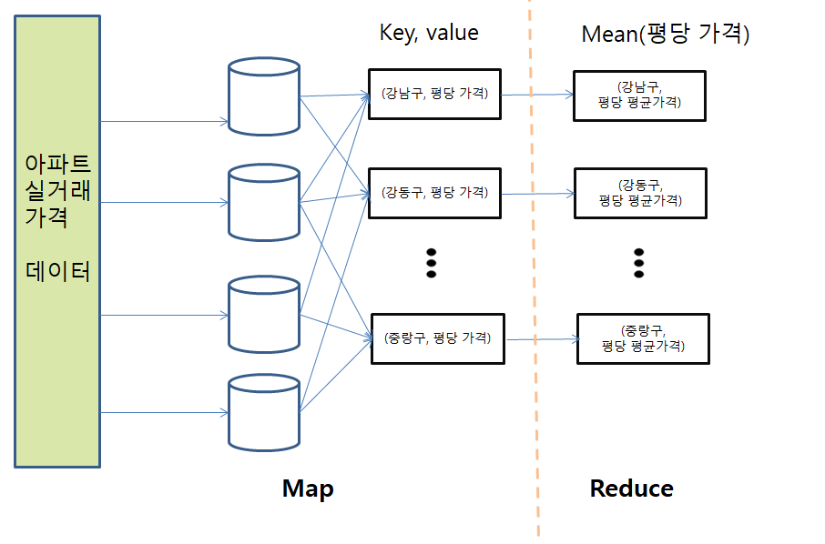
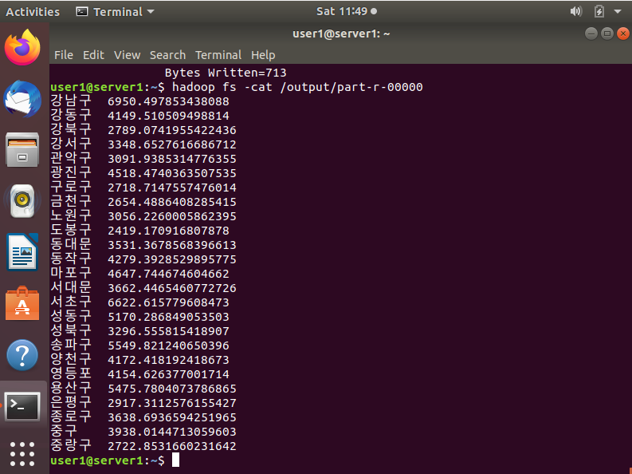

# 🐘 Hadoop Mini Project

## 하둡의 맵리듀스를 이용한 서울시 자치구별 평당 실거래가격 산출

- [최근 부동산에 관한 기사](https://www.news1.kr/articles/?4301925)로 인해 부동산 가격에 대한 관심이 많았다.
- 데이터는 [국토교통부 실거래가 공개시스템](http://rtdown.molit.go.kr/)의 2020년 5월부터 2021년 4월까지 서울시 데이터 사용

## 도식화
 
- Mapper에서 자치구와 아파트의 평당가격이 key, value쌍으로 묶여진다.
- Reducer에서 Mapper에서 받은 key, value쌍의 평균값을 계산된다.

## 📃결과
 
- 평당가격이 가장 높은 자치구는 '강남구'로 1평당 6950만원이다. 30평기준으로 20억 8500만원인 것으로 확인됐다.
- 결과를 확인하고 보니 왜 이렇게 실거래가격이 높은지 모르겠지만 부동산 가격이 많이 올라갔다는 것에 대한 뉴스 기사를 실감했다.
- 추후에 연도별로 실거래가격의 추이를 살펴보는 것도 좋다고 생각했다.