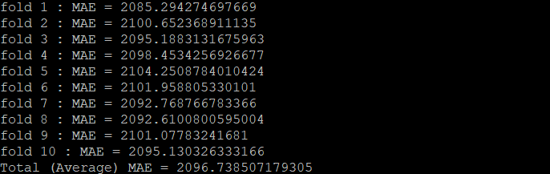

# 📝 ML mini-project

## This project is a mini project of the Department of Big Data Engineering ML course.
- Build models using ML skills learned in this subject.
- Data is "black-friday" in kaggle [here!](https://www.kaggle.com/dalalmanish/black-friday)
- This problem is 'Regression'! So, Measure is "MAE"
- I used MLP Regression model and saved the model using pickle.

## 📃 Result

