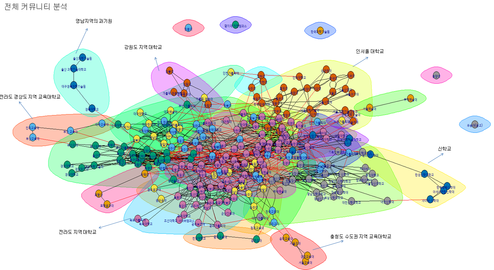

# 🌏 SN Analysis Mini Project

## 연관검색어 웹크롤링으로 서로 연관되어있는 대학들을 찾아보자

- 다음에서 각 대학교의 연관검색어를 크롤링
   - 전국 대학교 데이터는 [KESS(교육통계서비스)](https://kess.kedi.re.kr/post/6718944?itemCode=04&menuId=m_02_04_02)의 2020년 하반기 고등교육기관 주소록 ('20.10.1.) 참고
- 대학교와 대학교 사이의 네트워크 관계를 활용해서 대학교와 대학교 연관검색어의 특징을 알아보자한다.

## 📃결과

- 커뮤니티분석으로 확인해본 결과 각 대학교 연관검색어가 지역별 특성, 대학별 특성으로 나뉜다.
- 다른 대학데이터와 함께 융합해서 사용하면 좋을듯 하다.