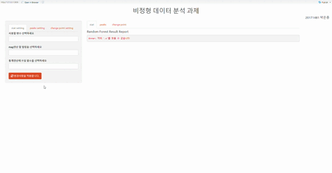

# 📃 HW2

### 🎯목적
HW1에서 했던 분석들을 가지고 Shiny App 제작

### 🔎내용
비정형 데이터 분석에서 배운 통계, 피크, 변화를 각각 탭으로 두었습니다.
통계, 피크, 변화분석 마다 추출 할 수 있는 feature들이 다르므로 사이드 패널에 탭을 두어서 각 분석(통계, 피크, 변화)들의 feature들을 생성하고 추출하는 것을 선택할 수 있습니다,
	-	통계분석에는 “사용할 변수”, “mag연산 할 변수”, “통계연산을 할 함수”를 선택할 수 있습니다.
	-	피크분석에는 “mag연산 할 변수”, “피크의 threshold값”, “crest의 f(HZ)값 조정”을 선택 할 수 있습니다.
	-	변화분석에는 “mag연산 할 변수”, “연산함수”를 선택 할 수 있습니다.

각각의 분석에서 변수, 함수들을 선택, 조정해주고 변경사항을 적용하면 머신러닝(랜덤포레스트)이 돌아가면서 cross-validation(10fold)을 실행하게 됩니다.
메인 패널에는 선택한 변수, 함수에 따른 랜덤포레스트 결과 리포트가 출력이 됩니다.

